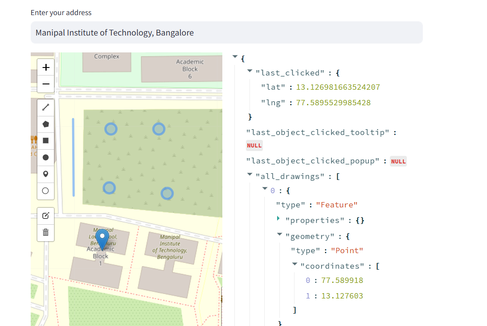

<h1 align "center"> PlexAAR for HackNXS </h1>
# Project description
This is the secondary repository for the PLEXAAR team. This contains details and code for all the models we used in our backend. \
The main repository for our hackathon can be found [here!](https://github.com/spicybeanos/PLEXAAR) \

# Repository guide
## requirements.txt
All the python libraries that we need to import are here. These 
## data.jsonl, model.py
This is the data that we have used to create the classifier model. There are 52 examples which had multi-labeled outputs. The classifier can understand natural language and give best predictions based on it \
- [x] Training a classification model

## maptest.py
This particular file shows you your locality/properties map after you enter you address. This map is given by using the nominatim api for OpenStreetMap. The file is meant to allow users to check weather a certain plant will fit in their area and to measure the total space they have in their place. Standard street data is used here as we could not afford to buy high resolution sattellite data for a hackathon. 
- [x] Getting accurate location down to the coordinate
- [ ] High resolution data

## fooddel.py
This uses the same libraries as above. Here we have marked three food banks in Bangalore to spread awareness. These foodbanks act as collectors towards the food donation. The file can also mark your location and point you to the nearest food bank for your location. You can also select a certain date to donate your food.

- [x] Spreading awareness about nearby food banks
- [x] Showing which food bank is closest to you